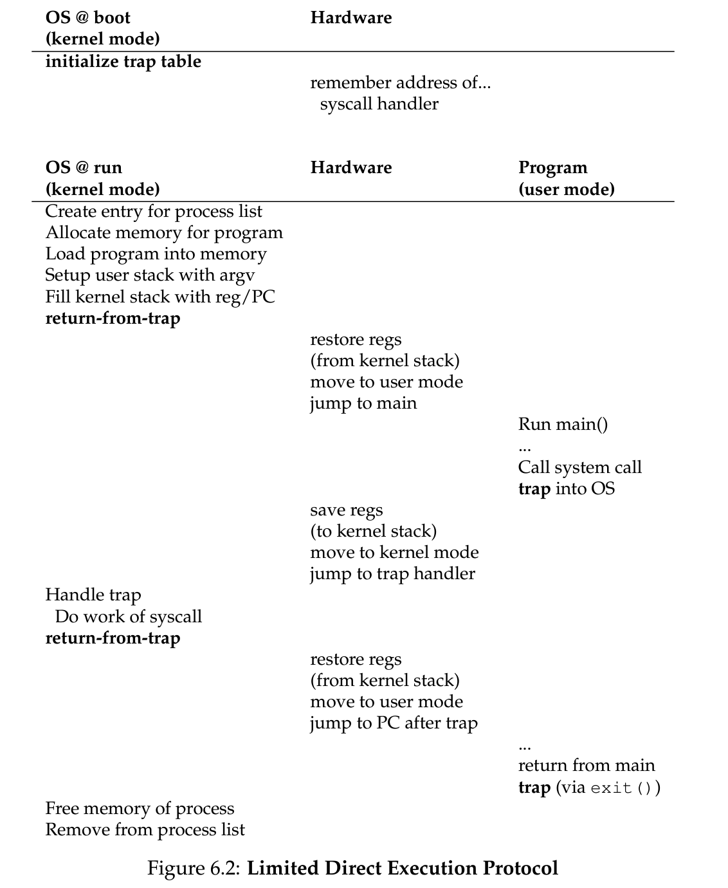
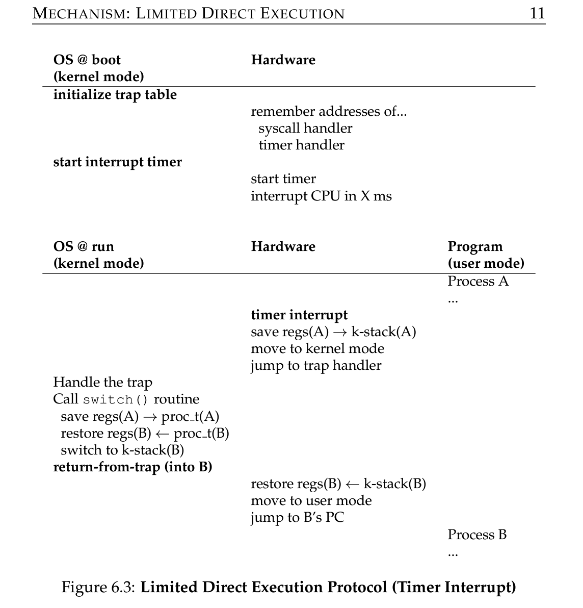

# Limited Direct Execution

**Time sharing:** Let one process run for a little while, then another etc. By time sharing, we achieve **virtualization**. Two major considerations while achieving this:

- Performance: Efficiently achieve it without adding too much overhead.
- Control: One process, for example, shouldn’t just run forever. OS must retain control.

Obtaining high performance while retaining control is the biggest challenge. Both OS and hardware support is required to achieve this.

**Limited Direct Execution**

Simplest technique: just run a program directly on the CPU:

- Create an entry in process list
- Allocate memory and load program into memory
- Setup runtime stack and argv/argc
- Clear CPU registers and trigger the `main()` or entry point of the program
    - OS gives control to the program at this point
    - Run `main()` and return
- OS frees up memory and removes entry from process list

The two challenges described above come into major play when designing like ^.

**Restricted Operations**

For the OS to maintain control and not have the program do whatever it likes, it needs to restrict certain operations. This may include issuing disk I/O requests, as that requires file privileges. We want to make the OS and the hardware work together to achieve this.

One approach is to let it do whatever but obviously undesired (can write to whole disk)

**Important jargons following**

New restricted processor mode: **user mode.** e.g., can’t issue I/O

The other mode is **kernel mode**, the mode OS runs in. 

When a user wants to do privileged/restricted operation, it issues a **system call**. About a few hundred sys calls are present. (see repo)

To execute a system call, the program issues a **trap** instruction, which jumps to kernel and raises privilege to kernel mode. When done with privileged operations, the OS calls a **return from trap** instruction, yielding control back to the program in user mode.

A per process **kernel stack** is used to store the instruction pointer, flags, registers etc to switch back and forth the modes.

How does OS know which code to run on a trap? Calling process can’t specify location to jump, as it can be hacked to run any arbitrary code. A **trap table** is setup at boot time by the kernel when its already in kernel mode. OS tells hardware what code to run on a sys call, exceptions, interrupts, etc. OS provides locations of these **trap handlers** (through special instructions). 

A **system call number** is assigned to each sys call which informs the OS of the code to execute. These numbers and the sys call args are carefully put into predefined registers. A lot of this is hardcoded into assembly with conventions. 

**Regaining Control**

Another problem the OS needs to deal with is to make sure it has control of the CPU to switch b/w processes.

- Cooperative: wait for sys calls - OS also provides `yield` syscall for processes to simply relinquish control to the OS.
- Non-cooperative: raise timer interrupt every so ms, and call the interrupt handler; at that point OS has control back of the CPU. Timer and handlers are setup at boot time in kernel mode. Hardware has to also store context about the interrupted process so that subsequent return-from-trap from OS can continue executing it. This is similar to a syscall flow.

After regaining control, the OS has to decide what to do next (resume same process or switch). **Scheduler** makes this decision; a switch causes a **context switch**. A context switch conceptually just needs storing the running processes’s state in a few register values, and restoring the state for the other process the OS wants to switch to.  State includes PC, stack pointer, general purpose registers. The kernel, therefore, implicitly switches the stack from one process to another and a return-from-trap will start/resume executing another process based on the new kernel stack pointer. 

